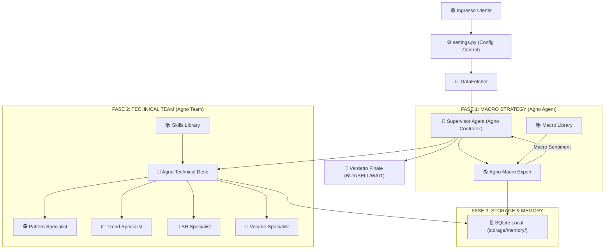

# ARCHITETTURA DEL SISTEMA: Trading Multi-Agent Desk (V5)

Questa documentazione descrive il sistema di analisi professionale basato sul framework **Agno**, configurabile tramite un modulo di impostazioni centralizzato.

## 1. Panoramica del Flusso (Diagramma)



### 1.2 Schema a Blocchi Logico V5 (Agno Powered)

```text
       UserSettings (In settings.py)
                    │
                    ▼
      ┌─────────────────────┐
      │     SETTINGS.PY     │  ← 1. Scegli Modelli (Flash/Pro)
      │   (Control Tower)   │  ← 2. Scegli Storage (Local/Remote)
      └─────────┬───────────┘
                │
                ▼
      ┌─────────────────────┐
      │  AGNO SUPERVISOR    │  ← Carica configurazioni
      │     (Controller)    │  ← Gestisce la sessione
      └─────────┬───────────┘
                │
                ├──────────────────────────────────────────┐
                ▼                                          │
      ┌─────────────────────┐                              │
      │  AGNO MACRO EXPERT  │  ← 3. Agentic File Search    │
      │  (The Strategist)   │    (Fundamentals Knowledge)  │
      └─────────┬───────────┘                              │
                │                                          │
                ├──────────────────────────────────────────┘
                ▼
      ┌─────────────────────┐
      │ AGNO TECHNICAL TEAM │  ← 4. Team Desk Coordination
      │ (Multi-Agent Team)  │  ← 5. Memory SQLite Local
      └─────────┬───────────┘
                │
         (Parallel Specialists)
      ┌─────────┴──────────────────────────────────────────┐
      ▼                    ▼               ▼               ▼
┌────────────┐      ┌────────────┐   ┌────────────┐  ┌────────────┐
│ PATTERN    │      │ TREND      │   │ SR         │  │ VOLUME     │
│ SPECIALIST │      │ SPECIALIST │   │ SPECIALIST │  │ SPECIALIST │
└──────┬─────┘      └──────┬─────┘   └──────┬─────┘  └──────┬─────┘
       │                   │                │               │
       └───────────────────┴───────┬────────┴───────────────┘
                                   │
                                   ▼
                        ┌─────────────────────┐
                        │ AGNO SYNTHESIS DESK │ ← 6. Resolve Conflicts
                        │ (Report Generator)  │ ← 7. Final Verdict
                        └─────────────────────┘
```

---

## 2. Il Cuore del Sistema: Configurazione Dinamica

L'architettura V5 è interamente "diretta" dal file **[settings.py](file:///Users/gpp/Programmazione/Trading/In%20Lavorazione/Trading_AI_App%20v2/settings.py)**. Questo permette all'utente di avere il controllo totale senza modificare il codice logico:

*   **Scelta degli LLM**: È possibile assegnare modelli diversi a ogni componente (es. `gemini-1.5-pro` per la strategia macro, `gemini-1.5-flash` per gli specialisti tecnici).
*   **Gestione Storage**: Permette di decidere se salvare la memoria delle analisi in **Locale** (default SQLite sul Mac) o in Remoto.
*   **Gestione Librerie**: Definisce i percorsi per i libri (`data/books`) e le skill tecniche.

---

## 3. Ruoli degli Agenti (Agno Framework)

### 🌎 Agno Macro Expert
*   **Modello**: Dinamico (da settings).
*   **Funzione**: Analizza i fondamentali macroeconomici utilizzando la **Gemini File Search**. Interroga il file `macro_fundamentals.md` per estrarre sentiment su DXY, inflazione e cicli.
*   **Memoria**: Salva le conclusioni nel database SQLite per coerenza futura.

### 📑 Agno Technical Desk (Team)
*   **Modello**: Dinamico (da settings).
*   **Struttura**: Un `Team` di Agno composto da 4 specialisti:
    1.  **Pattern Specialist**: Rilevamento candele e formazioni grafiche.
    2.  **Trend Specialist**: Analisi dello slancio e dei trend primari.
    3.  **SR Specialist**: Identificazione di Supporti, Resistenze e Fibonacci.
    4.  **Volume Specialist**: Analisi VSA e Wyckoff.
*   **Logica**: Il Team agisce come un'unica entità che interroga gli esperti e sintetizza i loro report in base al "Macro Sentiment" ricevuto.

### 📖 Agentic File Search (V5)
A differenza dei classici sistemi RAG, la V5 mantiene la ricerca file nativa di Gemini:
*   I libri e le skill vengono "letti" direttamente dai modelli Gemini tramite le loro API, garantendo una precisione superiore e citazioni dirette dei testi originali senza database vettoriali esterni costosi.

---

## 4. Tecnologie e Persistenza

*   **Agno SDK**: Gestisce la logica degli agenti, la memoria della sessione e l'orchestrazione del Team.
*   **SQLite**: Database locale utilizzato per la conservazione gratuita e privata della "storia" del trading desk.
*   **Gemini 1.5 Flash/Pro**: I motori di ragionamento del sistema.
*   **Loguru**: Monitoraggio in tempo reale del "pensiero" degli agenti.
