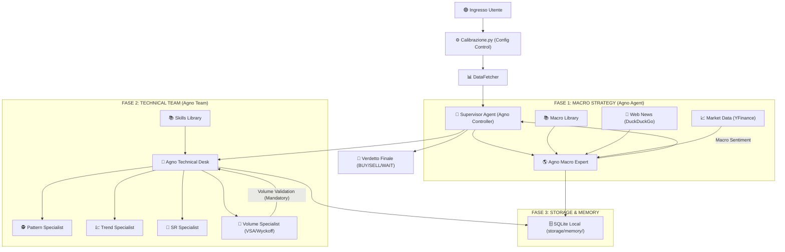

# ARCHITETTURA DEL SISTEMA: Trading Multi-Agent Desk (V5 - Agno v2.x)

Questa documentazione descrive il sistema di analisi professionale basato sul framework **Agno**, configurabile tramite un modulo di impostazioni centralizzato.

## 1. Panoramica del Flusso (Diagramma)



## 2. Sistema di Librerie (Memory Layers)

Il sistema utilizza tre livelli di conoscenza per garantire analisi basate su fonti autorevoli:

*   **📚 Libreria Libri (`data/books/`)**: Contiene i manuali originali in PDF (Joe Ross, Steve Nison, ecc.). È la sorgente "grezza" della conoscenza.
*   **🧠 Libreria delle Skill (`skills_library/`)**: Contiene file Markdown estratti dai libri. Sono regole di trading "pronte all'uso" che gli agenti tecnici consultano per identificare pattern e trend.
*   **🌍 Libreria Macro (`macro_library/`)**: Contiene i fondamentali economici (es. `macro_fundamentals.md`). È il manuale di riferimento per l'Agente Macro per interpretare i cicli di mercato.
*   **🏆 Manuale Best Practice (`documentazione/best_practice.md`)**: Contiene gli approcci dei trader professionisti. Serve da **Benchmark** per validare la qualità e la coerenza delle analisi prodotte dal sistema.

### 1.2 Schema a Blocchi Logico V5 (Agno Powered)

```text
       UserSettings (In settings.py)
                    │
                    ▼
      ┌─────────────────────┐
      │     SETTINGS.PY     │  ← 1. Scegli Modelli (Flash/Pro)
      │   (Control Tower)   │  ← 2. Scegli Storage (Local/Remote)
      └─────────┬───────────┘
                │
                ▼
      ┌─────────────────────┐
      │  AGNO SUPERVISOR    │  ← Carica configurazioni
      │     (Controller)    │  ← Gestisce la sessione
      └─────────┬───────────┘
                │
                ├──────────────────────────────────────────┐
                ▼                                          │
      ┌─────────────────────┐                              │
      │  AGNO MACRO EXPERT  │  ← 3. Agentic File Search    │
      │  (The Strategist)   │    (Fundamentals Knowledge)  │
      └─────────┬───────────┘                              │
                │                                          │
                ├──────────────────────────────────────────┘
                ▼
      ┌─────────────────────┐
      │ AGNO TECHNICAL TEAM │  ← 4. Team Desk Coordination
      │ (Multi-Agent Team)  │  ← 5. Memory SQLite Local
      └─────────┬───────────┘
                │
         (Parallel Specialists)
      ┌─────────┴──────────────────────────────────────────┐
      ▼                    ▼               ▼               ▼
┌────────────┐      ┌────────────┐   ┌────────────┐  ┌────────────┐
│ PATTERN    │      │ TREND      │   │ SR         │  │ VOLUME     │
│ SPECIALIST │      │ SPECIALIST │   │ SPECIALIST │  │ SPECIALIST │
└──────┬─────┘      └──────┬─────┘   └──────┬─────┘  └──────┬─────┘
       │                   │                │               │
       └───────────────────┴───────┬────────┴───────────────┘
                                   │
                                   ▼
                        ┌─────────────────────┐
                        │ AGNO SYNTHESIS DESK │ ← 6. Resolve Conflicts
                        │ (Report Generator)  │ ← 7. Final Verdict
                        └─────────────────────┘
```

---

## 2. Il Cuore del Sistema: Configurazione Dinamica

L'architettura V5 è interamente "diretta" dal file **[settings.py](file:///Users/gpp/Programmazione/Trading/In%20Lavorazione/Trading_AI_App%20v2/settings.py)**. Questo permette all'utente di avere il controllo totale senza modificare il codice logico:

*   **Scelta degli LLM**: È possibile assegnare modelli diversi a ogni componente (es. `gemini-2.0-flash` come standard economico e veloce, o `gemini-1.5-pro` per analisi profonde).
*   **Gestione Storage**: Permette di decidere se salvare la memoria delle analisi in **Locale** (SQLite sul Mac) o in Remoto.
*   **Gestione Librerie**: Definisce i percorsi per i libri (`data/books`) e le skill tecniche.

---

## 3. Logica di Comando e Gerarchia Decisionale

Il sistema non è una semplice sequenza di analisi, ma una **Gerarchia di Comando** dove l'Agente Macro funge da "Direttore Strategico":

1.  **Analisi di Contesto (Macro)**: L'Agente Macro raccoglie News, Prezzi e Fondamentali per definire il *Bias* (Bullish/Bearish).
2.  **Emissione del Comando**: Il Macro emette un "Ordine Strategico" che include obbligatoriamente il comando di **Deep Volume Scan** (Analisi Volumetrica Profonda).
3.  **Esecuzione Specialisti (Tech Team)**: Gli specialisti (Pattern, Trend, SR) eseguono i loro calcoli, ma devono farlo all'interno del perimetro deciso dal Macro.
4.  **Validazione Volumetrica (VSA/Wyckoff)**: Lo specialista dei volumi ha il ruolo di "Validatore Finale". Se il pattern tecnico suggerito dagli altri contrasta con lo sforzo/risultato dei volumi, il sistema declassa l'operazione ad "Alto Rischio".
5.  **Sintesi Finale**: Il Capo Desk unisce i pezzi dando peso prioritario alla convalida volumetrica.

---

## 3. Ruoli degli Agenti (Agno Framework)

### 🌎 Agno Macro Expert
*   **Modello**: Dinamico (da settings).
*   **Funzioni**:
    1.  **Analisi Fondamentale**: Interroga la libreria macro (`macro_fundamentals.md`) per estrarre sentiment su DXY e inflazione.
    2.  **Live News**: Equipaggiato con **DuckDuckGoTools**, effettua ricerche sul web (Sorgente: *DuckDuckGo Search*) per catturare news dell'ultima ora sull'asset analizzato.
    3.  **Dati Quantitativi**: Grazie a **YFinanceTools**, ottiene prezzi, volumi e variazioni percentuali istantanee (Sorgente: *Yahoo Finance*, ticker `GC=F` per l'Oro).
*   **Memoria**: Salva le conclusioni nel database SQLite per garantire coerenza tra diverse sessioni.

### 📊 Riassunto Strumenti e Sorgenti Dati
| Agente | Strumento (Tool) | Sorgente Dati (Data Source) | Contenuto |
| :--- | :--- | :--- | :--- |
| **Macro Expert** | `DuckDuckGoTools` | Web (Motore di Ricerca) | Notizie, Sentiment, Eventi |
| **Macro Expert** | `YFinanceTools` | Yahoo Finance | Prezzi Real-Time, Volumi, Ticker |
| **Macro Expert** | `Gemini Search` | Libreria Macro Locale | Fondamentali Economici, Bias |
| **Tech Team** | `Agentic Search` | Skills Library & Books | Regole di Trading, Pattern |

### 📑 Agno Technical Desk (Team)
*   **Modello**: Dinamico (da settings).
*   **Struttura**: Un `Team` di Agno composto da 4 specialisti coordinati:
    1.  **Pattern Specialist**: Rilevamento candele e formazioni grafiche.
    2.  **Trend Specialist**: Analisi dello slancio e dei trend primari.
    3.  **SR Specialist**: Identificazione di Supporti, Resistenze e Fibonacci.
    4.  **Volume Specialist (The Validator)**: Analisi VSA e Wyckoff ultra-approfondita.
*   **Logica di Pilotaggio**: Il Team riceve dal Macro Expert non solo una direzione, ma un **obbligo di convalida**. Il Volume Specialist agisce come "barriera": convalida o smentisce la forza dei pattern grafici analizzando se il movimento dei prezzi è sostenuto da capitali reali.
*   **Metodologie**: Wyckoff (Climax, Accumulazione, Distribuzione) e VSA (No Demand/Supply, Bag Holding).

### 📖 Agentic File Search & Hybrid Librarian (V5.1)
A differenza dei classici sistemi RAG, la V5 mantiene la ricerca file nativa di Gemini:
*   **Gemini (The Librarian)**: Gestisce la ricerca intelligente nei PDF tramite le sue API, garantendo precisione superiore e citazioni dirette.
*   **Qwen/Groq (The Analyst)**: Riceve i dati estratti da Gemini e coordina il team tecnico con velocità e logica superiori.

---

## 4. Supporto Multi-Modello e Configurazione Ibrida

Grazie al file **settings.py**, l'utente può scegliere dinamicamente quale "cervello" assegnare a ogni fase o componente:
*   **Analisi Macro**: Configurabile (es. Qwen 3 su Groq).
*   **Ricerca Conoscenza**: Delegata a Gemini (2.0 Flash) per la navigazione profonda dei libri.
*   **Analisi Tecnica**: Affidata a Qwen per le sue capacità nel function calling.

---

## 5. Tecnologie e Persistenza

*   **Agno SDK**: Core orchestrator (v2.x) per la logica multi-agente.
*   **Groq LPU**: Infrastruttura per l'inferenza ultra-veloce di Qwen.
*   **SQLite**: Database locale (`trading_system.db`) per la persistenza privata.
*   **Gemini & Qwen**: I motori di ragionamento combinati.
*   **Loguru**: Monitoraggio in tempo reale del "pensiero" degli agenti.

---

## 6. Guida Operativa (Quick Start)

### Avvio e Utilizzo
1.  **Analisi Asset**: Esegui `python3 app.py` per avviare il desk.
2.  **Configurazione**: Modifica `settings.py` per scegliere il provider (`LLM_PROVIDER`) e i modelli desiderati.

### Risoluzione Problemi Comune
*   **Errore Quota 429 / TPM (Groq/Google)**: Se si superano i limiti di token, il sistema attende automaticamente tramite i delay sequenziali impostati. Non vengono effettuati tagli al contesto per preservare l'integrità delle informazioni strategiche provenienti dai libri.
*   **Lentezza Git**: Se il commit è lento, verifica che `storage/` e `data/` siano correttamente nel `.gitignore`.
