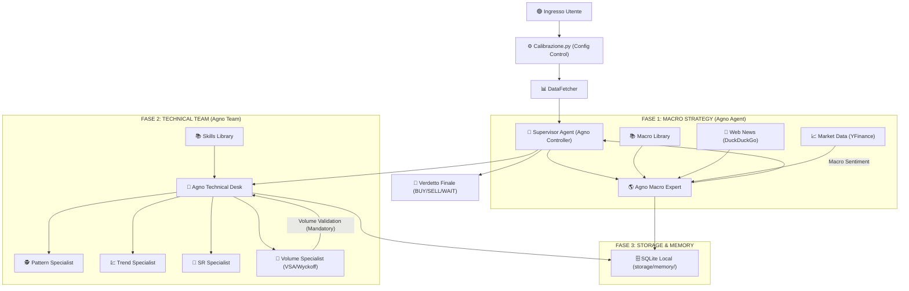

# ARCHITETTURA DEL SISTEMA: Trading Multi-Agent Desk (V5 - Agno v2.x)

Questa documentazione descrive il sistema di analisi professionale basato sul framework **Agno**, configurabile tramite un modulo di impostazioni centralizzato.

## 1. Panoramica del Flusso (Diagramma)



## 2. Sistema di Librerie (Memory Layers)

Il sistema utilizza tre livelli di conoscenza per garantire analisi basate su fonti autorevoli:

*   **📚 Libreria Libri (`data/books/`)**: Contiene i manuali originali in PDF (Joe Ross, Steve Nison, ecc.). È la sorgente "grezza" della conoscenza.
*   **🧠 Libreria delle Skill (`skills_library/`)**: Contiene file Markdown estratti dai libri. Sono regole di trading "pronte all'uso" che gli agenti tecnici consultano per identificare pattern e trend.
*   **🌍 Libreria Macro (`macro_library/`)**: Contiene i fondamentali economici (es. `macro_fundamentals.md`). È il manuale di riferimento per l'Agente Macro per interpretare i cicli di mercato.
*   **🏆 Manuale Best Practice (`documentazione/best_practice.md`)**: Contiene gli approcci dei trader professionisti. Serve da **Benchmark** per validare la qualità e la coerenza delle analisi prodotte dal sistema.

### 1.2 Schema a Blocchi Logico V5 (Agno Powered)

```text
       UserSettings (In settings.py)
                    │
                    ▼
      ┌─────────────────────┐
      │     SETTINGS.PY     │  ← 1. Scegli Modelli (Flash/Pro)
      │   (Control Tower)   │  ← 2. Scegli Storage (Local/Remote)
      └─────────┬───────────┘
                │
                ▼
      ┌─────────────────────┐
      │  AGNO SUPERVISOR    │  ← Carica configurazioni
      │     (Controller)    │  ← Gestisce la sessione
      └─────────┬───────────┘
                │
                ├──────────────────────────────────────────┐
                ▼                                          │
      ┌─────────────────────┐                              │
      │  AGNO MACRO EXPERT  │  ← 3. Agentic File Search    │
      │  (The Strategist)   │    (Fundamentals Knowledge)  │
      └─────────┬───────────┘                              │
                │                                          │
                ├──────────────────────────────────────────┘
                ▼
      ┌─────────────────────┐
      │ AGNO TECHNICAL TEAM │  ← 4. Team Desk Coordination
      │ (Multi-Agent Team)  │  ← 5. Memory SQLite Local
      └─────────┬───────────┘
                │
         (Parallel Specialists)
      ┌─────────┴──────────────────────────────────────────┐
      ▼                    ▼               ▼               ▼
┌────────────┐      ┌────────────┐   ┌────────────┐  ┌────────────┐
│ PATTERN    │      │ TREND      │   │ SR         │  │ VOLUME     │
│ SPECIALIST │      │ SPECIALIST │   │ SPECIALIST │  │ SPECIALIST │
└──────┬─────┘      └──────┬─────┘   └──────┬─────┘  └──────┬─────┘
       │                   │                │               │
       └───────────────────┴───────┬────────┴───────────────┘
                                   │
                                   ▼
                        ┌─────────────────────┐
                        │ AGNO SYNTHESIS DESK │ ← 6. Resolve Conflicts
                        │ (Report Generator)  │ ← 7. Final Verdict
                        └─────────────────────┘
```

---

## 2. Il Cuore del Sistema: Configurazione Dinamica

L'architettura V5 è interamente "diretta" dal file **[Calibrazione.py](file:///Users/gpp/Programmazione/Trading/In%20Lavorazione/Trading_AI_App%20v2/Calibrazione.py)**. Questo permette all'utente di avere il controllo totale senza modificare il codice logico:

*   **Scelta degli LLM**: È possibile assegnare modelli diversi a ogni componente (es. `gemini-2.0-flash` come standard economico e veloce, o `qwen/qwen3-32b` per analisi profonde).
*   **Gestione Storage**: Permette di decidere se salvare la memoria delle analisi in **Locale** (SQLite sul Mac) o in Remoto.
*   **Attivazione Agenti**: Consente di attivare o disattivare singoli specialisti (Pattern, Trend, SR, Volume) a seconda delle necessità operative.

---

## 3. Logica di Comando e Pesi Decisionali

### 3.1 Filosofia Decisionale: "Il Metodo della Gerarchia"
Per capire come il sistema arriva a un verdetto, è utile immaginarlo come un vero ufficio di trading dove ogni agente ha un grado diverso di autorità. La decisione non è una media matematica, ma il risultato di una **filiera di comando**:

1.  **Macro Esperto (La "Bussola"):** 
    Lavora sulla strategia globale. Decide in che direzione dobbiamo guardare. Se la bussola punta a Nord (Bullish), il team tecnico cercherà solo ingressi coerenti. Senza il suo "nulla osta" direzionale, il team tecnico opera con estrema cautela.
2.  **Team Tecnico (Il "Filtro di Precisione"):** 
    Se la Macro dà la direzione, i tecnici studiano il grafico per trovare il punto esatto. Ma non tutti i tecnici hanno lo stesso peso:
    *   **Volume Analyst (Il "Veto Finale"):** È l'analista più rispettato. Se nota che il movimento del prezzo non è supportato da volumi reali, ha il potere di marcare l'analisi come **"ALTO RISCHIO"**, invalidando di fatto l'entusiasmo degli altri.
    *   **Trend Analyst (Il "Geometra"):** Costruisce la "mappa" del mercato (SMA, EMA, Trendline). Se lui dice che siamo contro-trend, l'operazione viene declassata.
    *   **Pattern & SR Analyst (Gli "Esteti"):** Si occupano dei dettagli finali: la forma delle candele e i livelli di prezzo esatti.

### 3.2 Pesi dei Componenti (Gerarchia Tecnica)
Il sistema segue questa scala di importanza logica:
1.  **Macro Esperto (La Bussola - Peso Direzionale)**:
    *   Definisce il perimetro d'azione. Se il sentiment macro è negativo, i tecnici devono prioritariamente cercare segnali coerenti con tale visione. Non è un "voto", ma un'impostazione di contesto obbligatoria.
2.  **Volume Analyst (Il Validatore - Peso di Veto)**:
    *   È l'agente più influente del Team Tecnico. Funge da "filtro finale": se i pattern grafici non sono confermati dai volumi (sforzo vs risultato), il sistema declassa automaticamente l'operazione ad "Alto Rischio".
3.  **Trend & Specialists (Gli Esecutori - Peso Analitico)**:
    *   Forniscono la base tecnica. Il Trend definisce la struttura, i Pattern e i livelli SR forniscono i punti di ingresso.

### 3.3 Flusso Decisionale dettagliato (Ordine di Esecuzione)
Il sistema segue un ordine sequenziale rigoroso per garantire che ogni pezzo dell'analisi sia pronto per la sintesi finale:

1.  **Analisi di Contesto (Macro)**: Definizione del *Bias* globale.
2.  **Emissione del Comando**: Il Macro impone la direzione.
3.  **Esecuzione Specialisti Tecnici (In quest'ordine preciso):**
    *   **I. Pattern Analyst**: Cerca le forme delle candele.
    *   **II. Trend Analyst**: Definisce la direzione del prezzo.
    *   **III. SR Analyst**: Individua i livelli di rimbalzo.
    *   **IV. Volume Analyst (IL GIUDICE FINALE)**: Analizza lo sforzo dietro il movimento.
4.  **Validazione Volumetrica**: > [!IMPORTANT]
    > **Il Volume Analyst è l'ultimo a parlare perché la sua analisi ha il peso maggiore.** Se i volumi non confermano quanto visto dai primi tre specialisti, il sistema emette un avviso di **RISCHIO ELEVATO**, indipendentemente da quanto sia "bello" il pattern grafico.
5.  **Sintesi Finale**: Il report viene assemblato mettendo in risalto la convalida (o smentita) dei volumi.

### 3.4 La Cassetta degli Attrezzi: Fissa vs Dinamica
Il sistema non è un robot rigido che applica sempre le stesse regole. Ogni agente tecnico ha due modalità operative:

*   **Gli Strumenti "Standard" (Sempre pronti):** Sono i ferri del mestiere di base (Medie Mobili, Pivot Points, Trendline). Servono all'agente per avere sempre un punto di riferimento solido sul grafico.
*   **Gli Strumenti "Esperti" (Scelti dai Libri):** È qui che avviene la vera analisi professionale. Grazie alla **Skills Library**, l'agente ha accesso "mentale" alle tecniche di **Joe Ross, Steve Nison e Wyckoff**. L'IA analizza i dati e "pesca" dalla libreria solo la tecnica più adatta al momento:
    *   Se il mercato mostra un certo tipo di oscillazione, l'agente attiva lo strumento **"Ross Hook"**.
    *   Se vede un'indecisione, consulta le regole di **Nison** sulle candele giapponesi.
*   **Perché è importante?** Questa flessibilità permette all'agente di non essere un semplice indicatore matematico, ma un **analista che ragiona**. Se il mercato cambia, l'agente cambia attrezzo, proprio come farebbe un trader umano esperto che apre il suo manuale preferito al capitolo giusto.

### 3.5 Indipendenza di Analisi (Le "Stanze Separate")
Un punto fondamentale della filosofia del sistema è che ogni esperto tecnico lavora in **isolamento** dagli altri colleghi tecnici:

*   **Nessun "Contagio":** Quando l'esperto di Pattern analizza il grafico, non sa cosa sta pensando l'esperto di Volumi. Questo evita che un segnale grafico venga "scartato" o "influenzato" prima del tempo. L'analisi tecnica deve restare **pura**.
*   **Perché l'ordine è importante?** Anche se il Volume Specialist è l'ultimo a parlare nel report, la sua analisi è comunque indipendente. Non "corregge" gli altri agenti, ma fornisce un verdetto autonomo sui volumi.
*   **La Verità nella Sintesi:** È solo nel report finale che tu, l'utente, vedrai i pezzi del puzzle uniti. Vedrai la "bellezza" del pattern grafico descritta da un agente e la "forza reale" dei volumi descritta dall'altro. Questo ti permette di capire se un movimento è genuino o una trappola, senza che gli agenti si siano messi d'accordo prima "influenzandosi" a vicenda.

### 3.6 La Logica del Macro Strategista (Prezzi e News)
L'Agente Macro non prende decisioni basandosi su un singolo "fotogramma", ma guarda l'intero "film" del mercato:

*   **L'Analisi Prezzi/Volumi (La Serie Storica):** L'agente riceve una tabella dettagliata con i dati **OHLCV** (Apertura, Massimo, Minimo, Chiusura, Volume) delle ultime ore e degli ultimi giorni. Confrontando l'ultimo prezzo "Live" con questa tabella, capisce se il titolo sta accelerando, se è stanco o se sta rimbalzando su un livello storico. 
*   **L'Integrazione delle Notizie (Il "Perché"):** Le news servono a dare un senso ai numeri. L'agente le usa come un **Moltiplicatore di Fiducia**:
    *   **Conferma:** Se il prezzo sale e le news sono positive, l'agente dichiara un **Bias Forte**.
    *   **Divergenza (Allarme):** Se il prezzo sale ma le news sono negative, l'agente avverte che potrebbe trattarsi di una **Trappola**, dando un peso critico alle notizie per frenare l'entusiasmo tecnico.
    *   **Assenza di News:** Se non ci sono notizie rilevanti, il peso passa interamente alla dinamica tecnica dei prezzi.

#### **Sorgenti Dati e Precisione Real-Time**
Per garantire che l'analisi sia sempre aggiornata all'ultimo secondo, il sistema attinge da due fonti globali autorevoli:

1.  **I Volumi e i Prezzi (Yahoo Finance)**: Tutti i dati numerici arrivano direttamente dai server di **Yahoo Finance**. Questo garantisce precisione su ticker mondiali (come l'Oro `GC=F`, il Petrolio `CL=F` o le coppie Forex). Il sistema preleva non solo l'ultimo prezzo, ma anche i volumi scambiati nelle ultime 24 ore per validare la forza del mercato.
2.  **Il Radar Globale (DuckDuckGo Web Search)**: L'agente non è limitato a un database statico, ma "esce" sul web in tempo reale usando il motore di ricerca **DuckDuckGo**. Questo strumento agisce come un analista instancabile che scansiona diverse fonti:
    *   **Earnings e Trimestrali**: Cattura istantaneamente i report aziendali e i commenti degli analisti non appena vengono pubblicati.
    *   **Organismi Internazionali (FED, BCE)**: Monitora le decisioni sui tassi d'interesse, i comunicati ufficiali e le conferenze stampa dei grandi regolatori mondiali.
    *   **Forum e Sentiment Popolare**: DuckDuckGo è in grado di vedere anche cosa si dice nelle "piazze virtuali" come **Reddit** o **Forex Factory**. Questo permette all'agente di catturare il *Retail Sentiment* (l'umore dei piccoli trader), distinguendo tra i fatti nudi e crudi e le emozioni del mercato (euforia o panico).
    *   **Filtraggio Critico**: L'IA agisce poi da filtro, dando il peso massimo alle fonti istituzionali per i fatti, e usando i forum per misurare la psicologia della massa.

---

## 4. Ruoli degli Agenti (Agno Framework)

### 🌎 Agno Macro Expert
*   **Modello**: Dinamico (da settings).
*   **Funzioni**:
    1.  **Analisi Fondamentale**: Interroga la libreria macro (`macro_fundamentals.md`) per estrarre sentiment su DXY e inflazione.
    2.  **Live News**: Equipaggiato con **DuckDuckGoTools**, effettua ricerche sul web (Sorgente: *DuckDuckGo Search*) per catturare news dell'ultima ora sull'asset analizzato.
    3.  **Dati Quantitativi**: Grazie a **YFinanceTools**, ottiene prezzi, volumi e variazioni percentuali istantanee (Sorgente: *Yahoo Finance*, ticker `GC=F` per l'Oro).
*   **Memoria**: Salva le conclusioni nel database SQLite per garantire coerenza tra diverse sessioni.

### 📊 Riassunto Strumenti e Sorgenti Dati
| Agente | Strumento (Tool) | Sorgente Dati (Data Source) | Contenuto |
| :--- | :--- | :--- | :--- |
| **Macro Expert** | `DuckDuckGoTools` | Web (Motore di Ricerca) | Notizie, Sentiment, Eventi |
| **Macro Expert** | `YFinanceTools` | Yahoo Finance | Prezzi Real-Time, Volumi, Ticker |
| **Macro Expert** | `Gemini Search` | Libreria Macro Locale | Fondamentali Economici, Bias |
| **Tech Team** | `Agentic Search` | Skills Library & Books | Regole di Trading, Pattern |

### 📑 Agno Technical Desk (Team)
*   **Modello**: Dinamico (da Calibrazione.py).
*   **Struttura e Strumenti**:
    1.  **Pattern Specialist**: 
        *   *Strumenti*: Engulfing Patterns, Triangoli, Testa e Spalle.
        *   *Fonti*: Skill estratte dai testi di Joe Ross e Steve Nison.
    2.  **Trend Specialist**: 
        *   *Strumenti*: Medie Mobili (SMA, EMA), Trendline, SuperTrend.
        *   *Peso*: Fondamentale per definire la struttura del mercato.
    3.  **SR Specialist**: 
        *   *Strumenti*: Pivot Points, Livelli Psicologici, Aree Supply/Demand.
        *   *Peso*: Cruciale per identificare zone di rimbalzo o rottura.
    4.  **Volume Specialist (The Validator)**: 
        *   *Analisi*: VSA (Volume Spread Analysis) e Wyckoff.
        *   *Strumenti Specifici*: No Demand, Climax, SOS (Sign of Strength), Sforzo vs Risultato, Fasi di Accumulazione/Distribuzione.
        *   *Ruolo*: È l'unico con potere di smentita sui segnali degli altri specialisti.
*   **Logica di Pilotaggio**: Il Team riceve dal Macro Expert non solo una direzione, ma un **obbligo di convalida**. Il Volume Specialist agisce come "barriera": convalida o smentisce la forza dei pattern grafici analizzando se il movimento dei prezzi è sostenuto da capitali reali.

### 📖 Agentic File Search & Hybrid Librarian (V5.1)
A differenza dei classici sistemi RAG, la V5 mantiene la ricerca file nativa di Gemini:
*   **Gemini (The Librarian)**: Gestisce la ricerca intelligente nei PDF tramite le sue API, garantendo precisione superiore e citazioni dirette.
*   **Qwen/Groq (The Analyst)**: Riceve i dati estratti da Gemini e coordina il team tecnico con velocità e logica superiori.

---

## 4. Supporto Multi-Modello e Configurazione Ibrida

Grazie al file **Calibrazione.py**, l'utente può scegliere dinamicamente quale "cervello" assegnare a ogni fase o componente:
*   **Analisi Macro**: Configurabile (es. Qwen 3 su Groq).
*   **Ricerca Conoscenza**: Delegata a Gemini (2.0 Flash) per la navigazione profonda dei libri.
*   **Analisi Tecnica**: Affidabile e veloce grazie all'infrastruttura di Groq.

---

## 5. Tecnologie e Persistenza

*   **Agno SDK**: Core orchestrator (v2.x) per la logica multi-agente.
*   **Groq LPU**: Infrastruttura per l'inferenza ultra-veloce di Qwen.
*   **SQLite**: Database locale (`trading_system.db`) per la persistenza privata.
*   **Gemini & Qwen**: I motori di ragionamento combinati.
*   **Loguru**: Monitoraggio in tempo reale del "pensiero" degli agenti.

---

## 6. Guida Operativa (Quick Start)

### Avvio e Utilizzo
1.  **Analisi Asset**: Esegui `python3 app.py` per avviare il desk.
2.  **Configurazione**: Modifica `Calibrazione.py` per scegliere il provider (`LLM_PROVIDER`) e i modelli desiderati.

### Risoluzione Problemi Comune
*   **Errore Quota 429 / TPM (Groq/Google)**: Se si superano i limiti di token, il sistema attende automaticamente tramite i delay sequenziali impostati. Non vengono effettuati tagli al contesto per preservare l'integrità delle informazioni strategiche provenienti dai libri.
*   **Lentezza Git**: Se il commit è lento, verifica che `storage/` e `data/` siano correttamente nel `.gitignore`.
